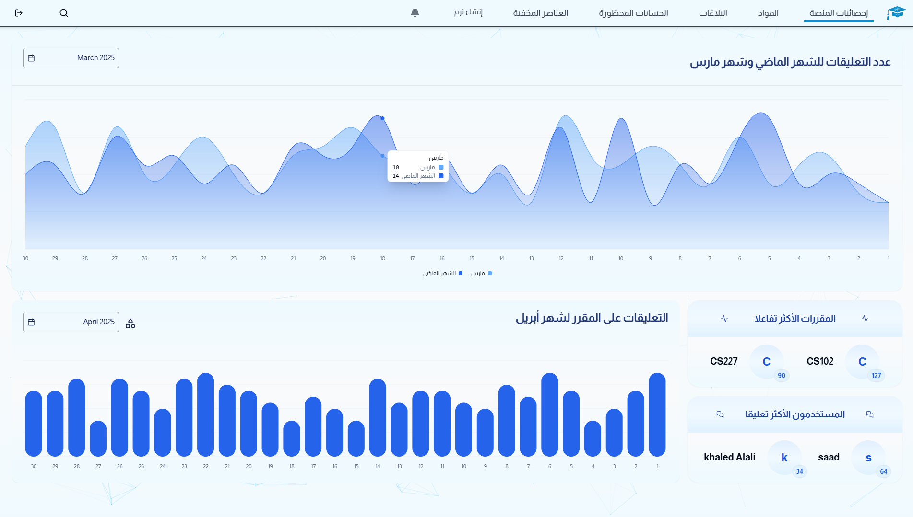

 
   

 

Tafawouq is a peer-to-peer AI-powered academic social platform created specifically for King Saud University students to increase collaboration and academic success. 

## Features 
- **Course Advice and Rating System**: Share and view course experiences to make informed decisions. 

- **GPA Calculator**: Input grades and credits to calculate your GPA. 

- **Quizzes**: Automatically generated quizzes using AI to test knowledge. 

- **Dashboard**: A visual analytics interface that shows monthly comment statistics, the most interactive courses, and the most active users. It helps administrators and students monitor engagement trends on the platform.  

## Technology Stack 
- **Frontend**: ReactJS, Shadcn/UI, Tailwind
- **Backend**: Node.js using ExpressJS framework 
- **Database**: PostgreSQL 
- **API Integration**: Gemini 2.0 Flash, Firebase from Google 
## Technology Stack

- **Frontend:** 

    

- **Backend:**
  
   
  

- **Database:**

   

- **API Integration:**

   (model 2.0 Flash) 
   
